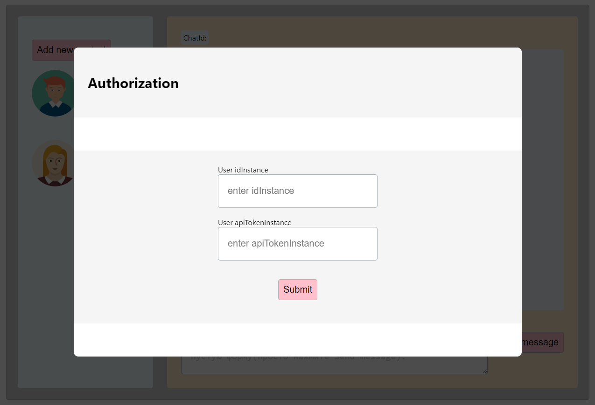
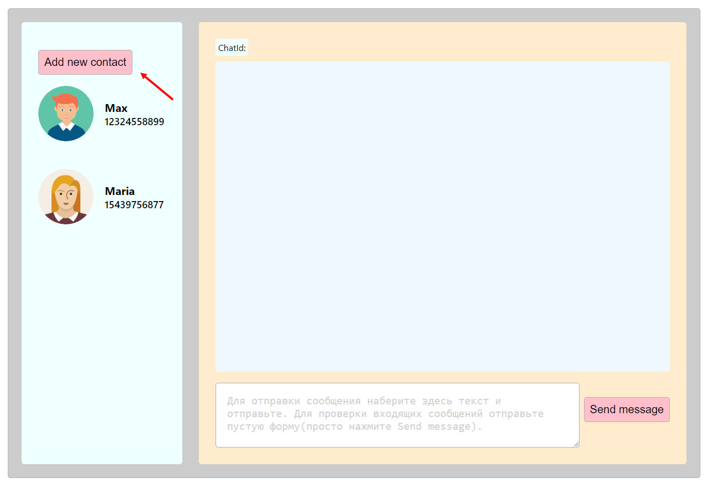
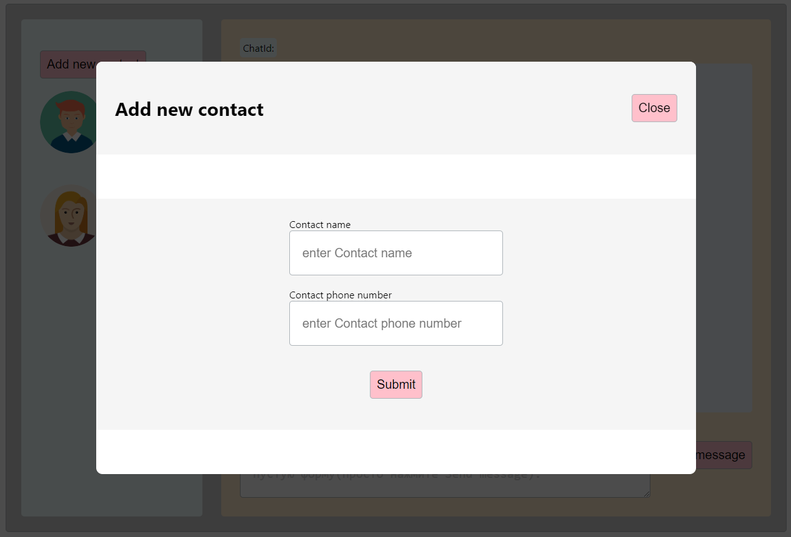
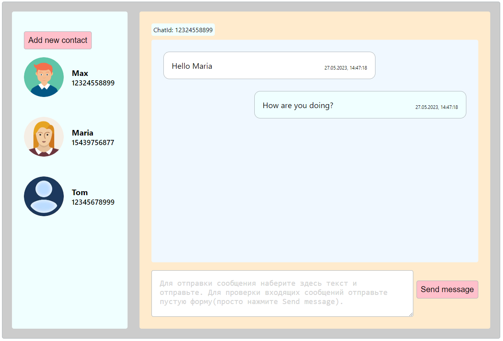

### Инструкция

1. Скачиваем папку с проектом
2. `npm install` находясь в папке
3. Запускаем `npm start`
4. При стартовом запуске - открыта модалка авторизации

5. Пользователь авторизуется: вводит idInstance и apiTokenInstance
6. Пользователь добавляет новый контакт по кнопке Add new contact: вводит имя и номер, привязанный к бизнес-аккаунту whatsapp (только цифры)

7. Для отправки сообщения: в поле формы вводится текст и отправляется нажатием кнопки Send message
8. Для проверки входящих нажимается кнопка Send message при пустой форме (если сообщения нет, ничего не меняется, если входящее сообщение доступно с Api, оно отображается в поле диалога)

